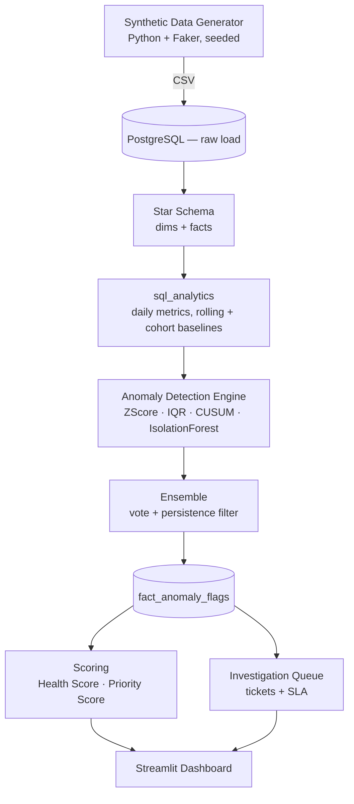

# SellerPulse — Marketplace Seller Health & Anomaly Command Center

**Detects deteriorating third-party marketplace sellers before customers notice — built end-to-end, evaluated honestly, deployed as a live dashboard.**

🔗 **Live Demo**: not yet deployed publicly — see [`docs/deployment.md`](docs/deployment.md) for the (tested, ready-to-run) deployment steps. Run it locally in under 5 minutes: see [How to Run Locally](#how-to-run-locally) below.

📊 [Architecture](docs/architecture.md) · 📖 [Data Dictionary](docs/data_dictionary.md) · 🧪 [Evaluation Report](docs/evaluation_report.md) · 💼 [Business Case Study](docs/business_case_study.md) · ☁️ [Deployment Guide](docs/deployment.md) · 🎤 [Interview Prep](docs/portfolio_presentation.md)

---

## Dashboard

| Executive Overview | Seller Risk Intelligence |
|---|---|
|  |  |

| Anomaly Intelligence | Investigation Operations |
|---|---|
|  |  |

| Seller 360 |
|---|
|  |

All five views are real screenshots against the live database — not mockups. Note the Anomaly Intelligence panel deliberately shows the project's actual (low) precision numbers rather than a flattering crop; see [Evaluation Results](#evaluation-results) below for why that's the honest outcome, not a bug.

---

## Problem statement

Marketplaces run thousands of third-party sellers whose operational quality — defect rates, shipping reliability, return patterns, review authenticity — can deteriorate quietly for weeks before it ever surfaces as a customer complaint. By the time a seller shows up in support escalations, the damage (bad orders shipped, customers churned) has already happened. SellerPulse is a system for catching that deterioration early: continuously monitoring every seller against its own history and its peers, flagging genuine anomalies (not noise), scoring risk transparently, and routing the highest-priority cases to a triage queue with SLAs — the same shape of system Amazon Seller Performance, Flipkart Seller Health, or Walmart Marketplace Ops actually run internally.

## Dataset scale

A synthetic marketplace with **realistic, non-uniform distributions** (segment-weighted seller sizes, right-skewed order volumes, left-skewed review ratings) — not random noise:

| | |
|---|---|
| Sellers | 2,000 (Micro/Small/Mid/Power segments, 4 tenure cohorts, 12 categories) |
| Products | 20,000 |
| Orders / Shipments | 3,433,760 / 3,366,368 |
| Returns / Reviews | 159,069 / 398,145 |
| Injected anomaly episodes | 160, across 8 labeled anomaly types |
| Daily seller-metric rows | 571,397 (the analytical spine every downstream table reads from) |

The 160 injected episodes are the whole point of using synthetic data here: real marketplace data has no ground truth for "was this actually an anomaly," so detection accuracy can't be honestly measured against it. This dataset can.

---

## Technical architecture



Full rationale for every design decision (why layered detection, why two separate scores, when each method fails, scaling notes): [`docs/architecture.md`](docs/architecture.md).

## PostgreSQL schema

Star schema — 4 dimensions, 5+ fact tables, `fact_seller_daily_metrics` as the analytical spine everything downstream reads from (never the raw order-line facts directly):

```mermaid
erDiagram
    dim_seller ||--o{ fact_orders : "sells via"
    dim_seller ||--o{ fact_seller_daily_metrics : "aggregates to"
    dim_seller ||--o{ fact_anomaly_flags : "flagged as"
    fact_anomaly_flags ||--o{ investigation_tickets : "opens"
    fact_orders ||--o| fact_shipments : "ships as"
    fact_orders ||--o| fact_returns : "may be returned as"
    dim_product ||--o{ fact_reviews : "reviewed as"

    dim_seller { bigint seller_id PK }
    fact_orders { bigint order_line_id PK }
    fact_seller_daily_metrics { bigint seller_id PK_FK }
    fact_anomaly_flags { bigint flag_id PK }
    investigation_tickets { bigint case_id PK }
```

Full ERD with every column and constraint: [`docs/architecture.md`](docs/architecture.md) · grain and modeling decisions per table (including a real bug found and fixed — return-rate cohort attribution): [`docs/data_dictionary.md`](docs/data_dictionary.md) · DDL: [`database/ddl/`](database/ddl/).

## SQL analytics

Window-function-heavy SQL, not ORM-generated queries — [`sql_analytics/`](sql_analytics/):
- `seller_daily_metrics.sql` — cohort-attributed daily KPI aggregation (CTEs, `LAG`/window frames)
- `rolling_stats.sql` — 28-day trailing self-baseline (rolling mean/std, excluding current day)
- `cohort_baselines.sql` — same-day peer-cohort baseline (tenure × category × segment)
- `business_questions/` — 10 standalone queries answering concrete ops questions (fastest-deteriorating sellers, category risk, investigator SLA performance, repeat offenders, etc.)

## Anomaly detection methodology

Four independent methods, deliberately layered rather than jumping straight to ML — see [`anomaly_engine/`](anomaly_engine/):

1. **Z-score** — self-baseline AND peer-cohort deviation must both exceed threshold (prevents flagging every seller during a category-wide event).
2. **IQR** — robust to skewed rate-metric distributions where z-score is distorted.
3. **CUSUM** — cumulative drift detection anchored to a pre-drift reference mean, for slow deterioration that a rolling baseline dilutes.
4. **Isolation Forest** — the only ML layer, trained per (tenure × segment) cohort, for multivariate combinations no single-metric method catches.
5. **Ensemble** — ≥2 methods must agree AND the signal must persist across 2+ distinct days before a flag becomes an actionable case.

### The multiple-testing problem, and how it was corrected

The first evaluation pass found raw single-flag precision of **~0.5–1.7%** — not a bug. At ~5-6M independent daily seller-metric statistical tests, even well-calibrated thresholds produce far more chance exceedances than true anomalies exist (true anomaly rate ≈0.6% of seller-days). Two concrete fixes were applied and verified to work:

1. Raised individual thresholds (z ≥ 3.0, CUSUM h = 8σ, IQR multiplier = 2.0).
2. Added a **persistence requirement** — the same (seller, anomaly_type) must flag on 2+ distinct days within a 3-day window before ensemble promotion.

This cut ensemble flag volume from 27,689 → 6,213 (≈4x). Full write-up, including that severity still doesn't correlate cleanly with precision (a second, subtler finding) and what a production fix looks like (False Discovery Rate control across each day's test batch): [`docs/evaluation_report.md`](docs/evaluation_report.md).

## Seller Health Score

0-100 **state** metric — weighted composite of defect rate (30%), late shipment rate (20%), return rate (15%), cancellation rate (10%), review signal (15%), and a 30-day anomaly penalty (10%). Each component normalized against a population 95th-percentile ceiling (with a documented fallback for zero-inflated metrics — a real bug the test suite caught, see [Testing](#testing)). Full weighting rationale: [`scoring/health_score.py`](scoring/health_score.py).

## Investigation Priority Score

0-100 **queue-ranking** metric, computed per anomaly flag (not per seller) — severity (35%), trailing-30-day GMV exposure (25%), trailing-30-day order volume as a customer-impact proxy (20%), and method-agreement count as a confidence signal (20%). Deliberately kept separate from Health Score: a stable-but-mediocre seller shouldn't outrank one with a fresh Critical anomaly today, and vice versa. Full rationale: [`scoring/priority_score.py`](scoring/priority_score.py).

## Investigation / SLA workflow

Only **High/Critical** severity ensemble flags spawn tickets (4,414 built from 6,213 ensemble flags) — same-day multi-flag sellers bundle into one case rather than one ticket per flag. SLA hours are severity-driven at intake (Critical=24h, High=72h, Medium=120h, Low=240h). Simulated investigator assignment, root-cause categorization (weighted per anomaly type), and resolution give the dashboard realistic historical case data — including a realistic false-positive rate and SLA breach rate (21-24% of closed tickets breached SLA in the current run). See [`investigation/`](investigation/).

## Business impact simulation

**Labeled as simulated/estimated everywhere it's surfaced** — [`docs/business_case_study.md`](docs/business_case_study.md). Compares actual detection delay against an assumed 10-day reactive baseline (customer-complaint-driven), restricted to the **45 tickets** that map to a known injected ground-truth episode (out of 3,118 total resolved/escalated tickets — applying the framing to unmatched tickets would fabricate a number against an episode with no real start date). Every cost assumption stated explicitly (investigator $45/hr, reactive vs. proactive investigation hours, per-order defect cost).

**Honest finding, not hidden**: mean days saved is only **0.9** in this run — a direct, visible consequence of the persistence requirement added to fix the precision problem (mean ensemble detection delay ≈9.5 days is already close to the assumed 10-day baseline). A looser configuration would show a bigger number at the cost of a noisier queue — that trade-off is documented plainly rather than picking whichever threshold flatters this section.

## Evaluation results

**All results below measure detection accuracy against deliberately injected, labeled synthetic anomalies — not a claim about real-world marketplace performance.**

| Method | Flags | Recall | Precision | F1 | Mean Detection Delay |
|---|---|---|---|---|---|
| ZScore | 33,474 | 44.4% | 0.62% | 0.0123 | 6.75 days |
| IQR | 63,118 | 38.8% | 0.53% | 0.0105 | 7.48 days |
| CUSUM | 19,729 | 39.4% | 0.57% | 0.0113 | 7.71 days |
| IsolationForest | 17,150 | 55.6% | 1.70% | 0.0329 | 7.08 days |
| **Ensemble** | **6,213** | **31.9%** | **1.82%** | **0.0344** | **9.55 days** |

Precision at the raw flag level is genuinely low — driven by the multiple-testing problem above, not a modeling error. Full method comparison, seller-level confusion matrix, per-anomaly-type recall, severity-tier precision breakdown, and 4 documented limitations (including that CUSUM's real value shows up on slow-drift types specifically, and why `Price_Anomaly` recall is near 0%): [`docs/evaluation_report.md`](docs/evaluation_report.md).

## Testing

**35 tests, all passing** — unit tests for ensemble voting/persistence/multi-metric-relabel logic, health/priority score normalization, synthetic data generator distributional properties (segment weights, tenure cohorts, price ranges), plus integration tests against the live database (every ensemble flag traces to ≥2 methods, every ticket references a valid flag, only High/Critical severities get tickets, health scores bounded 0-100, SLA deadlines always after detection).

**The test suite found 2 real bugs**, not zero — worth stating plainly: a health-score normalization function that returned "100 = perfectly healthy" for every seller when a metric's 95th percentile was exactly 0 (common for zero-inflated rate metrics), and an ensemble-building function that crashed on zero-candidate input instead of returning an empty result. Both fixed and covered by regression tests.

```bash
pytest tests/
```

## Limitations

- **Raw anomaly-flag precision is low** (0.5-1.8%) — see Evaluation Results above. Mitigated but not solved by the persistence requirement; a production system would add False Discovery Rate control across each day's test batch.
- **Severity doesn't cleanly correlate with precision** — Critical-severity flags are not more likely to be true positives than Low-severity ones in this run, because severity is derived from statistical magnitude, not calibrated against actual outcomes. A feedback loop from investigator resolutions (`False_Positive` vs `Resolved`) would close this gap; not built here.
- **Business impact numbers are estimates against stated assumptions**, not measured savings — no production baseline exists to compare against.
- **1:1 order-to-order-line grain** — this project doesn't model multi-item orders (documented simplification, see `docs/data_dictionary.md`).
- **Cloud demo runs a reduced dataset** (416MB vs. 2.9GB local) — see [Deployment](#deployment) below for exactly what's trimmed and why it doesn't affect dashboard functionality.
- **No Airflow/dbt** — a linear Python orchestrator was used instead; rationale for not defaulting to heavier tooling is in `docs/architecture.md`.

## Future improvements

Ranked by leverage, from `docs/portfolio_presentation.md`:
1. False Discovery Rate control (Benjamini-Hochberg) across each day's anomaly test batch — the single highest-leverage fix for the precision problem.
2. A feedback loop from investigator resolutions back into severity calibration.
3. Incremental/streaming scoring instead of full-history batch recompute, for real production scale.
4. A CUSUM-only rule tuned specifically for `avg_price` (current recall on `Price_Anomaly` is near 0%, since gradual price drift gets smoothed by the 28-day rolling baseline before crossing any single-day threshold).

## Tech stack

PostgreSQL · Python (pandas, NumPy, Faker, SQLAlchemy, scikit-learn, statsmodels) · SQL (CTEs, window functions, LAG/LEAD, rolling stats) · Streamlit + Plotly · Docker.

*(Power BI was evaluated and deliberately not built as a live artifact — no macOS-native Power BI Desktop, and a live Streamlit app better serves a public portfolio demo. A full Power BI page/data-model/DAX-measure spec is documented for anyone building the `.pbix` later — see `docs/architecture.md`.)*

## Repo layout

```
data_generator/   synthetic data generation + anomaly injection (ground truth kept separate)
database/         DDL for the star schema
deployment/       reduced-size cloud dataset export + schema for public deployment
sql_analytics/    daily metrics SQL, cohort/rolling baselines, 10 business-question queries
anomaly_engine/   z-score/IQR/CUSUM, Isolation Forest, ensemble, evaluation vs ground truth
scoring/          Seller Health Score + Investigation Priority Score
investigation/    ticket queue, SLA engine, simulated investigator workflow
pipeline/         daily orchestrator, data-quality checks, business impact simulation
streamlit_app/    5-tab dashboard (Executive Overview, Seller Risk Intelligence,
                  Anomaly Intelligence, Investigation Operations, Seller 360)
tests/            35 tests — unit (ensemble logic, scoring, data generator) + integration
docs/             architecture, data dictionary, evaluation report, business case study,
                  deployment guide, portfolio/interview prep
```

## How to run locally

```bash
python -m venv .venv && source .venv/bin/activate
pip install -r requirements.txt
cp .env.example .env      # defaults work as-is for local Docker Postgres
docker compose up -d      # starts Postgres on the port set in .env

# Full pipeline: generate data -> load -> validate -> transform -> detect -> score -> investigate -> evaluate
python -m pipeline.run_daily_pipeline

# Dashboard
streamlit run streamlit_app/app.py

# Tests
pytest tests/
```

Re-running just detection/scoring/investigation against already-loaded data (skips regeneration, ~2 min):
```bash
python -m pipeline.run_daily_pipeline --skip-generate --skip-load
```

## Deployment

Target: GitHub → Streamlit Community Cloud → cloud PostgreSQL, with a size-reduced dataset (2.9GB → 416MB local-tested, zero dashboard functionality lost — every table that's excluded was verified via `grep` to be unqueried by the app, or reduced to exactly the trailing window the app actually queries). Full walkthrough: [`docs/deployment.md`](docs/deployment.md).
