<h1 align="center">🛰️ SellerPulse</h1>
<p align="center"><b>Marketplace Seller Health &amp; Anomaly Command Center</b></p>
<p align="center">Detects deteriorating third-party marketplace sellers before customers notice — built end-to-end, evaluated honestly, deployed as a live enterprise dashboard.</p>

<p align="center">
  <a href="https://sellerpulse.streamlit.app"></a>
</p>
<p align="center">
  
  
  
  
  
</p>

<p align="center">
  🔗 <b><a href="https://sellerpulse.streamlit.app">Live Demo</a></b> &nbsp;·&nbsp;
  📂 <a href="https://github.com/Tisha1169/SellerPulse-Marketplace-Seller-Health-Anomaly-Command-Center">GitHub Repo</a> &nbsp;·&nbsp;
  📊 <a href="docs/architecture.md">Architecture</a> &nbsp;·&nbsp;
  🧪 <a href="docs/evaluation_report.md">Evaluation Report</a> &nbsp;·&nbsp;
  💼 <a href="docs/business_case_study.md">Business Case Study</a> &nbsp;·&nbsp;
  ☁️ <a href="docs/deployment.md">Deployment Guide</a>
</p>

---

## 60-second overview

Marketplaces run thousands of third-party sellers whose operational quality — defect rates, shipping reliability, return patterns, review authenticity — can quietly deteriorate for weeks before it ever surfaces as a customer complaint. **SellerPulse** is a full internal-tooling-style system for catching that early: it monitors every seller against its own history and its peers, runs four independent statistical/ML detection methods in an ensemble, scores risk transparently, and routes the highest-priority cases into an SLA-bound investigation queue — the same shape of system Amazon Seller Performance, Flipkart Seller Health, or Walmart Marketplace Ops run internally.

It's built on **2,000 synthetic sellers and 3.4M orders** with **160 deliberately injected, labeled anomalies** so detection accuracy can be measured honestly — including a real multiple-testing problem the evaluation surfaced and the concrete fix that was applied (not glossed over). It's deployed publicly: **PostgreSQL on Neon** + **Streamlit Community Cloud**.

## Dashboard preview

| Executive Overview | Seller Risk Intelligence |
|---|---|
| 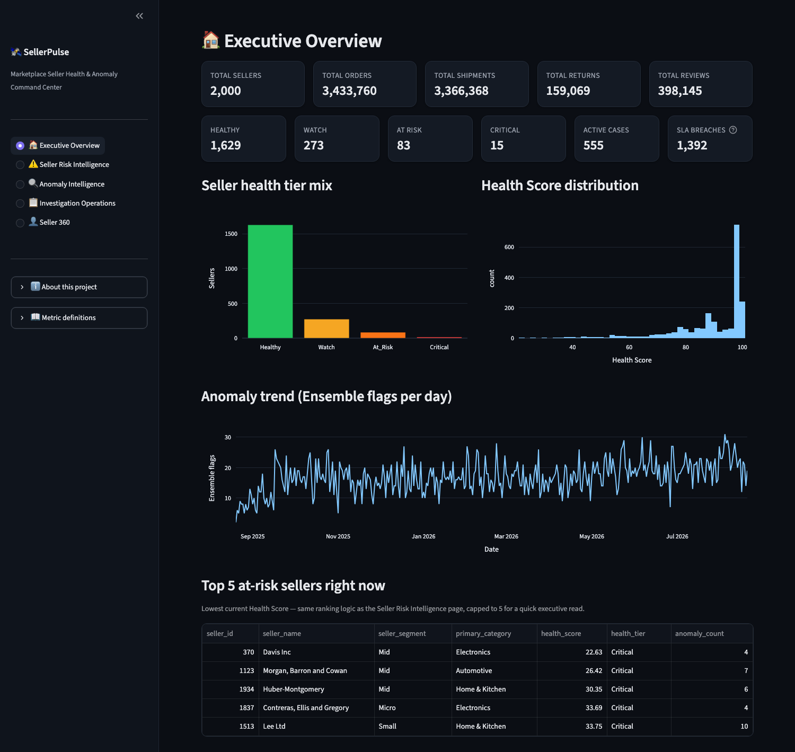 | 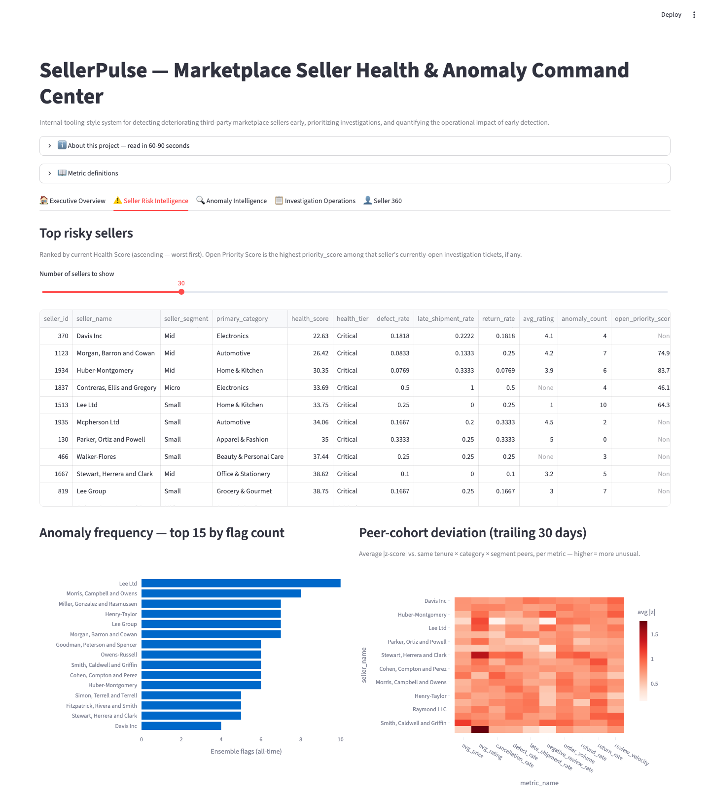 |

| Anomaly Intelligence | Investigation Operations |
|---|---|
| 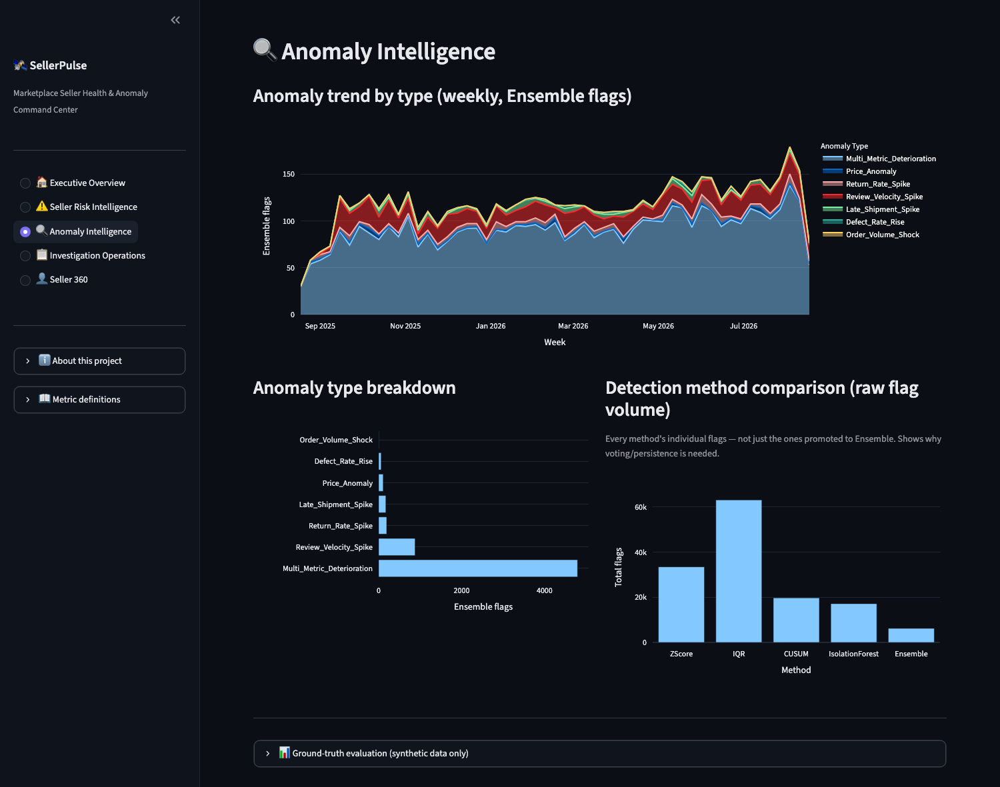 | 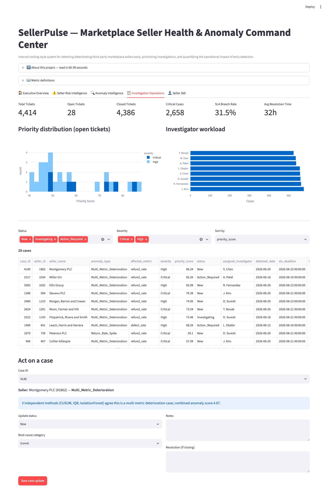 |

| Seller 360 |
|---|
| 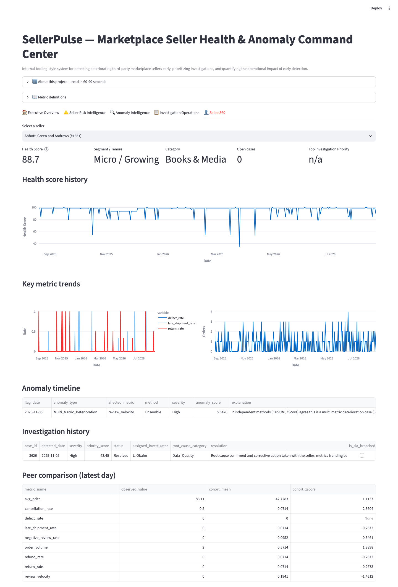 |

Real screenshots against the live database, not mockups — including the Anomaly Intelligence panel, which deliberately shows the project's actual (low) precision numbers rather than a flattering crop. See [Evaluation Methodology &amp; Limitations](#evaluation-methodology--limitations) for why.

---

## Why this project matters (for recruiters)

| Target role | What this project demonstrates |
|---|---|
| **Business / Data / BI Analyst** | SQL depth (window functions, cohort baselining, 10 standalone business-question queries), KPI definition and dashboard design, translating a vague business problem ("sellers going bad") into measurable metrics |
| **Operations Analytics** | An SLA-bound investigation workflow with ticket bundling, investigator workload tracking, and root-cause categorization — the actual mechanics of an ops queue, not just a chart |
| **Risk / Trust &amp; Safety Analytics** | A layered anomaly-detection engine (statistical + ML) evaluated against labeled ground truth, with an honest multiple-testing finding and fix — exactly the kind of false-positive/precision trade-off a fraud or risk team lives with daily |
| **Analytics Engineer** | A documented star schema with explicit grain decisions, a reproducible ETL pipeline, 35 automated tests (which caught 2 real bugs during development), and a production-style cloud deployment with a measured 86% dataset-size reduction |

**What makes this different from a generic student anomaly-detection project**: it doesn't stop at "I ran Isolation Forest and made a chart." It (1) measures its own detection accuracy against known ground truth and reports the real number even when that number is unflattering, (2) diagnoses *why* the number was low (a genuine statistical multiple-testing problem, not hand-waved), (3) separates a seller "health state" from an "investigation priority" as two deliberately different concepts — a distinction real marketplace ops teams actually make, and (4) ships as a working, publicly deployed application, not a notebook.

---

## Problem statement

By the time a deteriorating seller shows up in customer support escalations, the damage — bad orders shipped, customers churned — has already happened. Marketplace operations teams need continuous, automated monitoring that flags genuine deterioration early, filters out noise so investigators aren't drowning in false alarms, and prioritizes a finite investigation team's limited time against the sellers that matter most right now.

## Business use case

SellerPulse answers four operational questions continuously:
1. **Which sellers are deteriorating, and how badly?** → Seller Health Score, updated daily
2. **Is this deterioration a real signal or noise?** → 4-method anomaly ensemble with a persistence requirement
3. **Which case should an investigator open first this morning?** → Investigation Priority Score, independent of health state
4. **Is the investigation team keeping up?** → SLA tracking, resolution time, investigator workload

## Key capabilities

| Capability | Description |
|---|---|
| Synthetic marketplace data generator | Realistic (non-uniform) distributions, seeded and reproducible, with labeled anomaly injection |
| PostgreSQL star schema | 4 dimensions, 5+ fact tables, a daily-metrics spine every downstream query reads from |
| SQL analytics layer | Rolling self-baselines, peer-cohort baselines, 10 business-question queries — all window-function-heavy SQL |
| 4-method anomaly ensemble | Z-score, IQR, CUSUM drift detection, Isolation Forest, combined via voting + persistence |
| Ground-truth evaluation | Precision/recall/F1/confusion matrix against 160 labeled synthetic episodes |
| Seller Health Score | 0-100 transparent weighted composite (state metric) |
| Investigation Priority Score | 0-100 per-flag queue-ranking metric (event metric, deliberately separate from Health Score) |
| SLA-bound investigation workflow | Ticket bundling, simulated investigator assignment, root-cause categorization |
| Business impact simulation | Labeled-as-estimated, every assumption stated explicitly |
| Live dashboard | 5-page Streamlit app, dark enterprise theme, deployed publicly |

## Major results / metrics

| Metric | Value |
|---|---|
| Sellers / Products / Orders | 2,000 / 20,000 / 3,433,760 |
| Shipments / Returns / Reviews | 3,366,368 / 159,069 / 398,145 |
| Injected labeled anomaly episodes | 160, across 8 anomaly types |
| Daily seller-metric rows (analytical spine) | 571,397 |
| Ensemble flags generated | 6,213 (from 133,471 raw individual-method flags) |
| Ensemble recall / precision (vs. synthetic ground truth) | 31.9% / 1.82% — see [why this is low, honestly](#evaluation-methodology--limitations) |
| Mean detection delay (Ensemble) | 9.55 days |
| Investigation tickets generated | 4,414 |
| SLA breach rate (closed tickets) | 21-24% |
| Automated tests | 35, all passing |
| Local dataset size → deployed cloud size | 2.95GB → 415MB (86% reduction, zero dashboard functionality lost) |

## Tech stack

| Layer | Technology |
|---|---|
| Database | PostgreSQL (local: Docker; cloud: [Neon](https://neon.tech), serverless Postgres) |
| Backend / ETL | Python — pandas, NumPy, SQLAlchemy, Faker |
| Statistics / ML | scikit-learn (Isolation Forest), statsmodels |
| SQL | Raw CTEs, window functions, LAG/LEAD, rolling aggregates — no ORM query generation |
| Dashboard | Streamlit + Plotly |
| Testing | pytest (35 tests) |
| Deployment | GitHub → Streamlit Community Cloud, secrets via `st.secrets` |
| Local dev | Docker Compose |

---

## System architecture

```mermaid
flowchart TD
    A[Synthetic Data Generator<br/>Python + Faker, seeded] -->|CSV| B[(PostgreSQL — raw load)]
    B --> C[Star Schema<br/>dims + facts]
    C --> D[SQL Analytics Layer<br/>daily metrics, rolling + cohort baselines]
    D --> E[Anomaly Detection Engine<br/>ZScore · IQR · CUSUM · IsolationForest]
    E --> F[Ensemble<br/>vote + persistence filter]
    F --> G[(fact_anomaly_flags)]
    G --> H[Scoring<br/>Health Score · Priority Score]
    G --> I[Investigation Queue<br/>tickets + SLA]
    H --> J[Streamlit Dashboard<br/>5 pages, sidebar nav, deployed publicly]
    I --> J
```

## End-to-end data flow (daily pipeline)

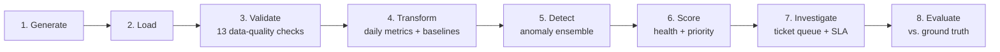

Orchestrated by [`pipeline/run_daily_pipeline.py`](pipeline/run_daily_pipeline.py) — a hard stop occurs before the transform stage if any data-quality check fails.

## Database schema (star schema)

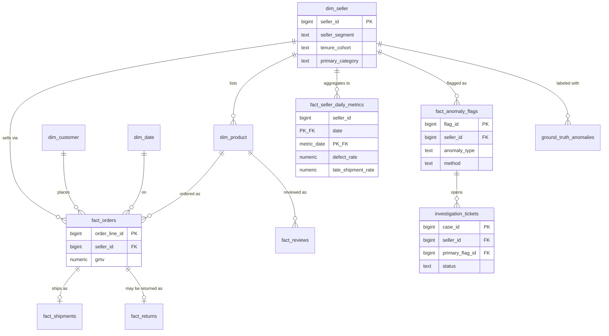

Full DDL: [`database/ddl/`](database/ddl/) · grain and modeling decisions per table (including a real bug found and fixed — return-rate cohort attribution): [`docs/data_dictionary.md`](docs/data_dictionary.md).

## SQL analytics

Window-function-heavy SQL, not ORM-generated queries — [`sql_analytics/`](sql_analytics/):
- `seller_daily_metrics.sql` — cohort-attributed daily KPI aggregation
- `rolling_stats.sql` — 28-day trailing self-baseline (rolling mean/std, excluding current day)
- `cohort_baselines.sql` — same-day peer-cohort baseline (tenure × category × segment)
- `business_questions/` — 10 standalone queries (fastest-deteriorating sellers, category risk, investigator SLA performance, repeat offenders, etc.)

## Anomaly detection methodology

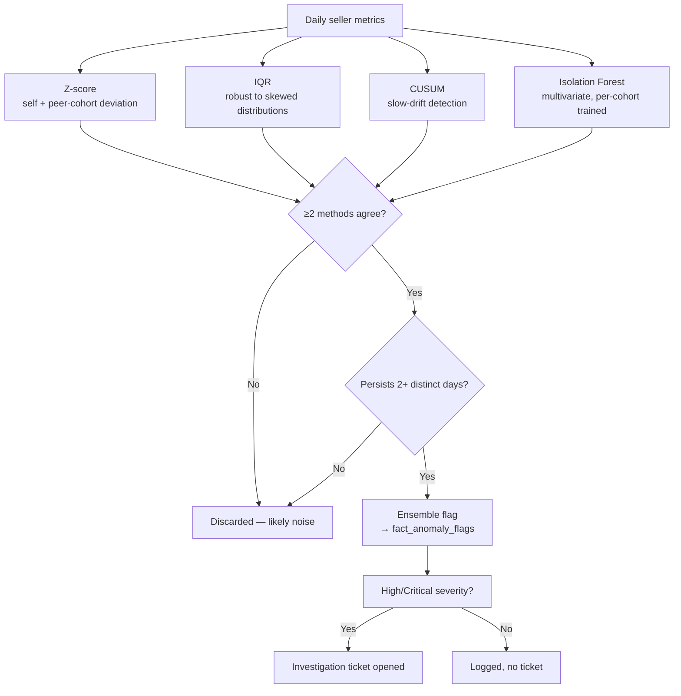

Four independent methods, deliberately layered rather than jumping straight to ML — see [`anomaly_engine/`](anomaly_engine/):
1. **Z-score** — self-baseline AND peer-cohort deviation must both exceed threshold
2. **IQR** — robust to skewed rate-metric distributions where z-score is distorted
3. **CUSUM** — cumulative drift detection anchored to a pre-drift reference mean, for slow deterioration a rolling baseline dilutes
4. **Isolation Forest** — the only ML layer, trained per (tenure × segment) cohort, for multivariate combinations no single-metric method catches
5. **Ensemble** — ≥2 methods must agree AND the signal must persist across 2+ distinct days before a flag becomes actionable

### The multiple-testing problem, and how it was corrected

The first evaluation pass found raw single-flag precision of **~0.5–1.7%** — not a bug. At ~5-6M independent daily seller-metric statistical tests, even well-calibrated thresholds produce far more chance exceedances than true anomalies exist (true anomaly rate ≈0.6% of seller-days). Two concrete fixes were applied and verified to work:
1. Raised individual thresholds (z ≥ 3.0, CUSUM h = 8σ, IQR multiplier = 2.0)
2. Added a **persistence requirement** — the same (seller, anomaly_type) must flag on 2+ distinct days within a 3-day window before ensemble promotion

This cut ensemble flag volume from 27,689 → 6,213 (≈4x). Full write-up: [`docs/evaluation_report.md`](docs/evaluation_report.md).

## Scoring framework

**Seller Health Score** (0-100, *state*) — weighted composite of defect rate (30%), late shipment rate (20%), return rate (15%), cancellation rate (10%), review signal (15%), and a 30-day anomaly penalty (10%). Each component normalized against a population 95th-percentile ceiling. [`scoring/health_score.py`](scoring/health_score.py)

**Investigation Priority Score** (0-100, *per-flag queue ranking*) — severity (35%), trailing-30-day GMV exposure (25%), trailing-30-day order volume as a customer-impact proxy (20%), and method-agreement count as a confidence signal (20%). [`scoring/priority_score.py`](scoring/priority_score.py)

These are deliberately **not merged**: a stable-but-mediocre seller shouldn't outrank one with a fresh Critical anomaly today, and vice versa — health is a slow-moving state, priority is an event-driven ranking.

## Investigation / SLA workflow

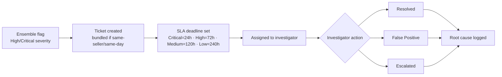

Only **High/Critical** severity ensemble flags spawn tickets (4,414 tickets from 6,213 ensemble flags) — same-day multi-flag sellers bundle into one case. Simulated investigator assignment, root-cause categorization (weighted per anomaly type), and resolution give the dashboard realistic historical case data, including a realistic false-positive rate and SLA breach rate. [`investigation/`](investigation/)

---

## Dashboard walkthrough

| Page | What it shows |
|---|---|
| 🏠 **Executive Overview** | Marketplace-wide KPIs, health tier mix, health score distribution, anomaly trend, top-5 at-risk sellers |
| ⚠️ **Seller Risk Intelligence** | Ranked risky sellers, anomaly frequency, peer-cohort deviation heatmap |
| 🔍 **Anomaly Intelligence** | Anomaly trend by type, method comparison, the project's own ground-truth evaluation report |
| 📋 **Investigation Operations** | Ticket KPIs, priority distribution, investigator workload, filterable queue with live case-status write-back |
| 👤 **Seller 360** | One-seller deep dive — health history, KPI trends, anomaly timeline, investigation history, peer comparison |

## KPIs tracked

Order volume, GMV, defect rate, late shipment rate, cancellation rate, return rate, refund rate, average rating, negative-review rate, review velocity, price volatility, order growth rate — all computed in [`sql_analytics/seller_daily_metrics.sql`](sql_analytics/seller_daily_metrics.sql) and stored in `fact_seller_daily_metrics`, the single source every downstream score and chart reads from.

## Evaluation methodology & limitations

**All evaluation numbers measure detection accuracy against deliberately injected, labeled synthetic anomalies — not a claim about real-world marketplace performance.**

| Method | Flags | Recall | Precision | Mean Detection Delay |
|---|---|---|---|---|
| ZScore | 33,474 | 44.4% | 0.62% | 6.75 days |
| IQR | 63,118 | 38.8% | 0.53% | 7.48 days |
| CUSUM | 19,729 | 39.4% | 0.57% | 7.71 days |
| IsolationForest | 17,150 | 55.6% | 1.70% | 7.08 days |
| **Ensemble** | **6,213** | **31.9%** | **1.82%** | **9.55 days** |

Full method comparison, confusion matrix, per-type recall, and 4 documented limitations (including that severity doesn't yet correlate cleanly with precision, and why `Price_Anomaly` recall is near 0%): [`docs/evaluation_report.md`](docs/evaluation_report.md).

**Known limitations, stated plainly:**
- Raw anomaly-flag precision is low (0.5-1.8%) — a genuine multiple-testing consequence, mitigated but not solved
- Severity doesn't cleanly correlate with precision — a feedback loop from investigator resolutions would close this gap; not built here
- Business impact numbers are estimates against stated assumptions, not measured savings — see [`docs/business_case_study.md`](docs/business_case_study.md)
- 1:1 order-to-order-line grain (documented simplification, no multi-item orders modeled)
- Cloud demo runs a reduced 60-day peer-baseline window vs. the full local history

## Business impact simulation

Compares actual detection delay against an assumed 10-day reactive baseline, restricted to the **45 tickets** that map to a known injected ground-truth episode (out of 3,118 total resolved/escalated tickets — applying the framing to unmatched tickets would fabricate a number against an episode with no real start date). Every cost assumption stated explicitly. **Honest finding, not hidden**: mean days saved is only 0.9 in this run, a direct consequence of the persistence requirement added to fix precision. Full write-up: [`docs/business_case_study.md`](docs/business_case_study.md).

---

## Deployment architecture

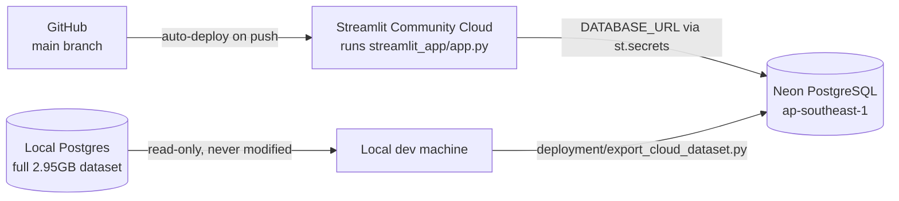

The live app at **[sellerpulse.streamlit.app](https://sellerpulse.streamlit.app)** runs on Streamlit Community Cloud, reading a **415MB** Neon PostgreSQL database — a deliberately size-reduced export of the full local dataset (see below), not a smaller synthetic dataset.

### Why 415MB instead of 2.95GB

Rather than trim the analytical dataset itself, every table the dashboard actually queries was identified by grepping `streamlit_app/app.py` for every `FROM core.` reference. Result:
- 4 raw fact tables (`fact_orders`, `fact_shipments`, `fact_returns`, `fact_reviews`, ~1.07GB combined) were only ever used for 4 headline `COUNT(*)`s — replaced by a tiny precomputed `dataset_summary` table
- `seller_metric_rolling_baseline` (747MB) — not queried by the dashboard at all
- `seller_metric_cohort_baseline` (898MB) — trimmed to a 60-day trailing window (the dashboard only ever queries the latest day or trailing 30 days)

Verified by actually running the export against a throwaway Postgres instance before deploying, and re-testing every page against the reduced database — zero dashboard functionality lost. Full reasoning: [`docs/deployment.md`](docs/deployment.md).

### Performance note

Each query to the Neon database costs ~460ms in pure network round-trip latency (cross-region), and the free tier autosuspends after inactivity (cold-start on first query). The autosuspend cost is inherent to the free tier; the redundant-round-trip cost was fixed by caching every read-only query (5-minute TTL) — repeat page views are now near-instant, while a genuinely fresh page load still pays real network cost. Stated honestly rather than hidden: [`docs/deployment.md`](docs/deployment.md#performance-why-the-free-tier-demo-isnt-instant-and-what-was-done-about-it).

## Security / secrets handling

- No credentials are ever committed — `.env` and `.streamlit/secrets.toml` are both gitignored; only placeholder `.env.example` / `.streamlit/secrets.toml.example` files are tracked
- The deployed app reads its database connection from Streamlit Community Cloud's encrypted **Secrets** panel (`DATABASE_URL`), never from a file in the repo
- The app runs a connection health check on startup — if the database is unreachable, it shows one readable error naming which config to check, and only the exception *type*, never the raw exception text (some drivers embed the DSN/password in error strings)
- Verified via `git grep` across the full commit history: no connection string, password, or API key has ever been committed to this repository

## Testing

**35 tests, all passing** — unit tests for ensemble voting/persistence/multi-metric-relabel logic, health/priority score normalization, synthetic data generator distributional properties, plus integration tests against the live database. **The test suite found 2 real bugs** during development (a health-score normalization edge case and an ensemble zero-candidate crash) — both fixed and covered by regression tests.

```bash
pytest tests/
```

## Local setup

```bash
python -m venv .venv && source .venv/bin/activate
pip install -r requirements.txt
cp .env.example .env      # defaults work as-is for local Docker Postgres
docker compose up -d      # starts Postgres on the port set in .env

# Full pipeline: generate data -> load -> validate -> transform -> detect -> score -> investigate -> evaluate
python -m pipeline.run_daily_pipeline

# Dashboard
streamlit run streamlit_app/app.py

# Tests
pytest tests/
```

## Cloud deployment (Neon + Streamlit Community Cloud)

1. Provision a free Postgres on [Neon](https://neon.tech)
2. `export CLOUD_DATABASE_URL="<neon-connection-string>"` → `python -m deployment.export_cloud_dataset` (builds the reduced schema and streams data over, ~10s)
3. Push to GitHub
4. On [share.streamlit.io](https://share.streamlit.io): New app → this repo → `streamlit_app/app.py` → add `DATABASE_URL` in **Advanced settings → Secrets** → Deploy

Full step-by-step with exact commands: [`docs/deployment.md`](docs/deployment.md).

## Repository structure

```
data_generator/   synthetic data generation + anomaly injection (ground truth kept separate)
database/         DDL for the full local star schema
deployment/       reduced-size cloud dataset export + schema for public deployment
sql_analytics/    daily metrics SQL, cohort/rolling baselines, 10 business-question queries
anomaly_engine/   z-score/IQR/CUSUM, Isolation Forest, ensemble, evaluation vs ground truth
scoring/          Seller Health Score + Investigation Priority Score
investigation/    ticket queue, SLA engine, simulated investigator workflow
pipeline/         daily orchestrator, data-quality checks, business impact simulation
streamlit_app/    5-page dashboard (sidebar nav, dark enterprise theme)
tests/            35 tests — unit (ensemble logic, scoring, data generator) + integration
docs/             architecture, data dictionary, evaluation report, business case study,
                  deployment guide, Power BI spec, portfolio/interview prep
```

## Future improvements

Ranked by leverage:
1. **False Discovery Rate control** (Benjamini-Hochberg) across each day's anomaly test batch — the single highest-leverage fix for the precision problem
2. A feedback loop from investigator resolutions back into severity calibration
3. Incremental/streaming scoring instead of full-history batch recompute, for real production scale
4. A CUSUM-only rule tuned specifically for `avg_price` (current recall on `Price_Anomaly` is near 0%)

*(Power BI was evaluated and deliberately not built as a live artifact — no macOS-native Power BI Desktop, and a live Streamlit app better serves a public portfolio demo. A full Power BI page structure, data model, relationships, and DAX measures are documented for anyone building the `.pbix` later — see [`docs/powerbi_spec.md`](docs/powerbi_spec.md).)*

---

<p align="center"><a href="https://sellerpulse.streamlit.app">🔗 Live Demo</a> · <a href="https://github.com/Tisha1169/SellerPulse-Marketplace-Seller-Health-Anomaly-Command-Center">📂 GitHub</a></p>
