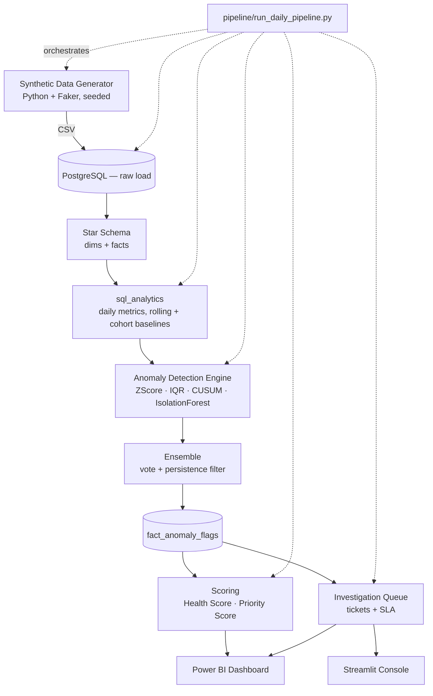
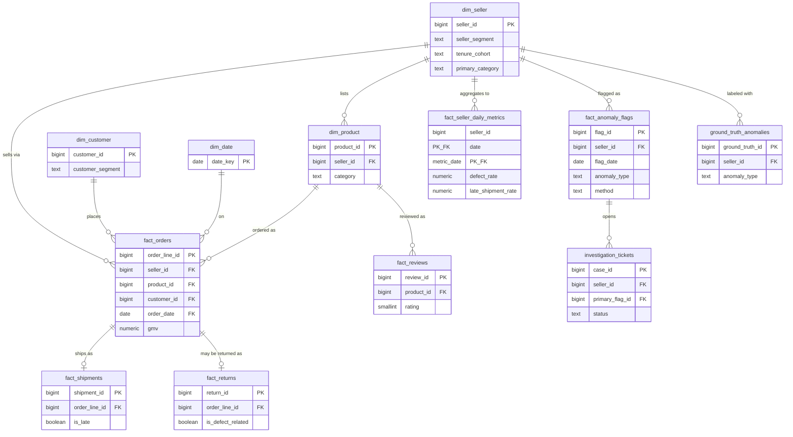

# Architecture

## System overview

**Why this shape:** raw → warehouse → semantic/star layer → decision layer (anomaly + scoring) → consumption (BI + app) mirrors how a real marketplace ops-analytics stack is layered. Each arrow is a natural place to add a scheduler dependency (Airflow task, dbt model, etc.) without restructuring the rest.

## Star schema (ERD)

Full DDL with all constraints/indexes: [`database/ddl/`](../database/ddl/).

## Why Health Score and Priority Score are separate

**Seller Health Score** (`scoring/health_score.py`) is a *state* metric: a slow-moving, weighted composite of a seller's operational rates, reviews, and recent anomaly penalty, on 0-100. It answers "how healthy is this seller right now."

**Investigation Priority Score** (`scoring/priority_score.py`) is a *queue-ranking* metric computed per anomaly flag: severity, financial exposure, customer impact, and detection confidence. It answers "which case should an investigator open first this morning."

A seller can have a mediocre health score (Watch tier, nothing new happening this week) with zero investigation urgency — and a seller with a good health score can have a fresh, severe anomaly that must jump the queue today. Merging these into one number would lose that distinction, which is exactly the distinction an operations team needs to act on.

## Why the anomaly engine is layered, not ML-first

1. **Z-score / IQR** (interpretable, first line of defense) — every flag carries a baseline value, observed value, and deviation in the metric's own units. An investigator can read the reason directly.
2. **CUSUM** — catches slow drift that a rolling baseline dilutes (the baseline itself drifts upward with a slow-burn anomaly, weakening z-score's signal). Anchored to a pre-drift reference mean specifically so it doesn't degenerate into z-score.
3. **Isolation Forest** — the only genuinely ML layer, and deliberately last: catches multivariate combinations no single-metric method can see, at the cost of not naming a specific baseline/deviation (mitigated by reporting the top contributing feature via per-feature z-score).
4. **Ensemble** — requires ≥2 independent methods to agree AND persistence across 2+ distinct days before a flag becomes actionable. This wasn't the initial design — it was added after the first evaluation pass (see `docs/evaluation_report.md`) surfaced a genuine multiple-testing problem: at ~5-6M independent daily seller-metric tests, even well-calibrated single-day thresholds produce far more chance exceedances than true anomalies. The persistence requirement is the direct, evidence-driven fix.

**When each method fails**, honestly:
- Z-score assumes roughly symmetric, non-skewed distributions — rate metrics near their floor (mostly 0) violate this, which is why IQR exists alongside it.
- IQR itself fails on low-count integer data (its fence collapses to near-zero) — this is why `order_volume` is explicitly excluded from the IQR method (see `anomaly_engine/zscore_iqr.py`).
- CUSUM's reference anchor is only as good as the "pre-drift" window it's computed from; a seller that was already drifting when monitoring started has no clean anchor.
- Isolation Forest trained globally would just rediscover "small sellers look different from big sellers" as the dominant signal — trained per (tenure_cohort × segment) cohort instead.

## Data quality in production (what's out of scope here)

`pipeline/data_quality_checks.py` runs 13 SQL-based checks and prints a pass/fail report — appropriate for a single-node batch job. A production system would instead: run checks as part of ingestion (e.g. Great Expectations or dbt tests) with per-check alerting, quarantine failing rows into a dead-letter table rather than allowing bad data into `core.*` at all, and track check pass rates over time as their own monitored metric. Not built here to keep scope bounded to what a single portfolio project can credibly own end-to-end.

## Why not Airflow

A daily batch job over a single Postgres instance doesn't need a scheduler with retries, backfills, and a UI — `pipeline/run_daily_pipeline.py` is a linear Python script with the same stage boundaries an Airflow DAG would have (`stage_generate` → `stage_load` → `stage_dq` → `stage_transform` → `stage_detect` → `stage_score` → `stage_investigate` → `stage_evaluate`), so migrating to Airflow later would mean wrapping each stage as a task, not redesigning the pipeline. Building Airflow for a single-node daily job would be technology for its own sake — worth naming explicitly rather than defaulting to "biggest tool available."

## Scalability notes (if this were real production scale)

- `fact_seller_daily_metrics` and the two baseline tables are the highest-cardinality analytical outputs (571K and 5.16M rows respectively at this project's scale) — at real marketplace scale (millions of sellers) these would need partitioning by date and likely a columnar store (BigQuery/Snowflake/Redshift) rather than a single Postgres instance.
- The anomaly engine currently loads full tables into pandas per run; at real scale this would need to run as distributed batch (Spark) or be reformulated as incremental (only re-score the trailing window, not full history) — the SQL layer (window functions, rolling baselines) was written to be portable to a warehouse SQL engine with minimal changes.
- Isolation Forest is retrained per cohort on every run; a production version would persist trained models and only retrain periodically (e.g. weekly), scoring new data against the existing model daily.
